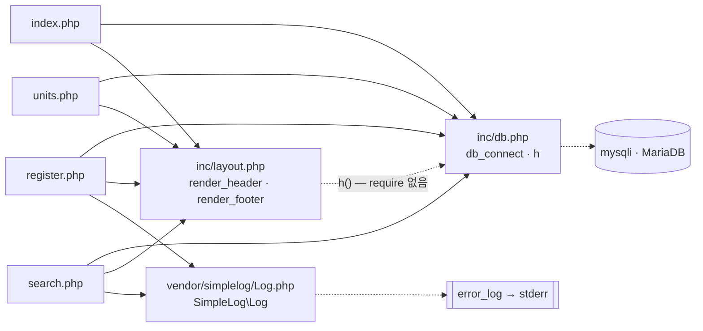

# legacy/item-bank-php 아키텍처

> 분석 범위: 진입점 · 의존 관계. 데이터 흐름 · 비즈니스 규칙은 아직 분석하지 않았다.
> 근거는 `파일:줄번호`(경로는 `legacy/item-bank-php/` 기준)로 적는다. 직접 열어 확인하지 못한 것은 "미확인"으로 둔다.

## 1. 모듈 개요

- 문항 검색 · 등록 · 단원 목록 화면 3개와 홈으로 된 PHP 화면 모듈이다(`index.php:9-11`).
- 라우터 · 프레임워크 없이 최상위 `.php` 파일 하나가 URL 하나다(`Dockerfile:14`).
- `php:7.4-apache` 위에서 `mysqli` 로 MariaDB `itembank` 에 붙는다(`Dockerfile:1,3`, `inc/db.php:16,21`).
- 오류는 화면에 내지 않고 stderr 로 기록한다(`Dockerfile:9-11`).
- 코드 1,104줄 중 `search.php` 가 731줄이다.

## 2. 폴더 구조

```
legacy/item-bank-php/
├── Dockerfile                  실행 환경 (php:7.4-apache, mysqli)
├── index.php          14줄     홈 (메뉴)
├── units.php          48줄     단원 목록
├── register.php      177줄     문항 등록 (GET 폼 · POST 저장)
├── search.php        731줄     문항 검색
├── inc/
│   ├── db.php         37줄     db_connect(), h()
│   └── layout.php     43줄     render_header(), render_footer()
└── vendor/
    └── simplelog/
        └── Log.php    54줄     SimpleLog\Log (외부 라이브러리 더미, error_log 로 기록)
```

`.htaccess` · `composer.json` · 빌드 산출물은 없다.

## 3. 진입점

| URL / 화면 | 처음 실행되는 파일 | 부르는 주요 함수 (근거) |
|---|---|---|
| `/index.php` 홈 | `index.php` | `render_header('홈')` `index.php:5`, `render_footer()` `index.php:14`. DB 호출 없음 |
| `/units.php` 단원 목록 | `units.php` | `render_header` `units.php:5`, `db_connect` `units.php:8`, `$conn->query`(SELECT) `units.php:20`, `h` `units.php:40-43`, `render_footer` `units.php:48` |
| `/register.php` 문항 등록 (GET 폼 · POST 저장) | `register.php` | `db_connect` `register.php:17`, 선택 목록 SELECT `register.php:27,34`, POST 분기 `register.php:40`, 트랜잭션 · INSERT `register.php:85-114`, `Log::info` / `Log::error` `register.php:115,121`, `render_header` `register.php:127`, `render_footer` `register.php:177` |
| `/search.php` 문항 검색 (GET) | `search.php` | `Log::setThreshold` `search.php:27`, `render_header` `search.php:709`, `db_connect` `search.php:713`, `buildSearchQuery($_GET, $conn)` `search.php:722`, `renderSearchForm` `search.php:723`, `runSearchQuery` `search.php:724`, `renderResultTable` `search.php:725`, `Log::error` `search.php:727` |
| `/` (루트) | 미확인 | 저장소에 DirectoryIndex 설정이 없다 |
| `/inc/*.php`, `/vendor/**` 직접 접근 | 막는 설정이 저장소에 없다 | 정의만 있고 최상위 출력은 없다(`inc/db.php`, `inc/layout.php`, `vendor/simplelog/Log.php` 전체) |

## 4. 의존 관계

화살표는 "A → B (A가 B를 포함 · 호출)" 방향이다. 실선은 `require_once`, 점선은 함수 호출이다.



### 파일 포함 (`require_once`)

| A → B | 근거 |
|---|---|
| `index.php` → `inc/db.php`, `inc/layout.php` | `index.php:2-3` |
| `units.php` → `inc/db.php`, `inc/layout.php` | `units.php:2-3` |
| `register.php` → `inc/db.php`, `inc/layout.php`, `vendor/simplelog/Log.php` | `register.php:2-4` |
| `search.php` → `inc/db.php`, `inc/layout.php`, `vendor/simplelog/Log.php` | `search.php:20-22` |

### 함수 호출

| A → B (호출 대상) | 호출 위치 | 대상 정의 |
|---|---|---|
| 화면 4개 → `render_header`, `render_footer` | 3절 표 | `inc/layout.php:7,38` |
| `units.php` · `register.php` · `search.php` → `db_connect` | `units.php:8`, `register.php:17`, `search.php:713` | `inc/db.php:7` |
| 화면 → `h` | `units.php:40-43`, `register.php:131,136` 등 | `inc/db.php:34` |
| **`inc/layout.php` → `h`** (숨은 의존: `db.php` 를 `require` 하지 않음. 모든 화면이 `db.php` 를 먼저 포함해서 동작한다) | `inc/layout.php:17,33` | `inc/db.php:34` |
| `register.php` → `SimpleLog\Log` | `register.php:115,121` | `vendor/simplelog/Log.php:28,38` |
| `search.php` → `SimpleLog\Log` | `search.php:27,103,528,537,727` | `vendor/simplelog/Log.php:18,23,38` |
| `Log` → PHP `error_log()` (stderr) | `vendor/simplelog/Log.php:52` | `Dockerfile:11` |
| `search.php` 최상위 → `buildSearchQuery`, `renderSearchForm`, `runSearchQuery`, `renderResultTable` | `search.php:722-725` | `search.php:42,629,571,647` |
| `search.php` 함수 → `h` | `search.php:360,416,457,674-678` 등 | `inc/db.php:34` |
| `inc/db.php` → `mysqli` 확장 | `inc/db.php:21` | `Dockerfile:3` |

### 참조하는 DB 객체 (이름만 확인)

| 객체 | 참조 위치 |
|---|---|
| `unit` | `units.php:18`, `register.php:27`, `search.php:125,156` |
| `tag` | `register.php:34`, `search.php:178,244` |
| `item` | `units.php:17`, `register.php:87,93` |
| `item_tag` | `register.php:105`, `search.php:244` |
| `v_item_public` | `search.php:245,522` |

## 5. 가장 긴 함수 3개

| 순위 | 파일 | 함수 | 시작–끝 | 길이 | 하는 일 |
|---|---|---|---|---|---|
| 1 | `search.php` | `buildSearchQuery` | 42–564 | 523줄 | GET 파라미터로 WHERE · ORDER BY · LIMIT SQL을 조립하고, 폼 HTML · 정렬/페이지 링크 · 경고 문구까지 함께 만든다 |
| 2 | `search.php` | `renderResultTable` | 647–704 | 58줄 | 경고 · 조건 요약 · 건수 · 결과 표 · 페이지 이동 링크를 출력한다 |
| 3 | `search.php` | `runSearchQuery` | 571–624 | 54줄 | 건수 쿼리와 목록 쿼리를 prepared statement 로 차례로 실행해 `total` · `rows` 를 돌려준다 |

- `buildSearchQuery` 는 `search.php` 의 약 71%다. 안에서 DB 조회 3회(`search.php:125,156,178`)와 HTML 생성(`search.php:354-516`)이 SQL 조립과 섞여 있다.
- 그다음은 `render_header` 30줄(`inc/layout.php:7-36`), `db_connect` 23줄(`inc/db.php:7-29`)이다.

## 6. 미확인 목록

| 항목 | 상태 | 확인할 곳 |
|---|---|---|
| `/` 요청이 `index.php` 로 가는지 | 미확인. 저장소에 설정이 없고 `php:7.4-apache` 이미지 기본값에 달려 있다 | 이미지 Apache 설정 · 실제 요청 |
| `/inc/`, `/vendor/` 직접 접근 차단 여부 | 미확인. 저장소에는 차단 설정이 없다 | 실제 요청 |
| 뷰 `v_item_public` 의 정의 | 미확인 | `db/mariadb/init/01-schema.sql` |
| `v_item_public` 이 `status='A'` 로 거르는지 | 미확인. 주석은 "공개 문항 뷰"라고만 한다(`search.php:519`) | `db/mariadb/init/01-schema.sql` |
| 테이블 컬럼 · 제약 (`item`, `unit`, `tag`, `item_tag`) | 미확인 | `db/mariadb/init/01-schema.sql` |
| 난이도 빈값일 때 조건 — 주석 "1~5 모두 포함"(`search.php:213`)과 코드 `AND level < 5`(`search.php:215`)가 다르다 | 코드는 확인했고, 의도와 레거시 실제 동작 여부는 미확인 | 비즈니스 규칙 단계 · 시드 데이터 |
| 등록 ID를 `MAX(id)+1` 로 직접 매김(`register.php:87`), 신규 상태 `'R'`(`register.php:94`) | 코드는 확인했고, 스키마의 AUTO_INCREMENT 여부는 미확인 | 데이터 흐름 단계 · `01-schema.sql` |
