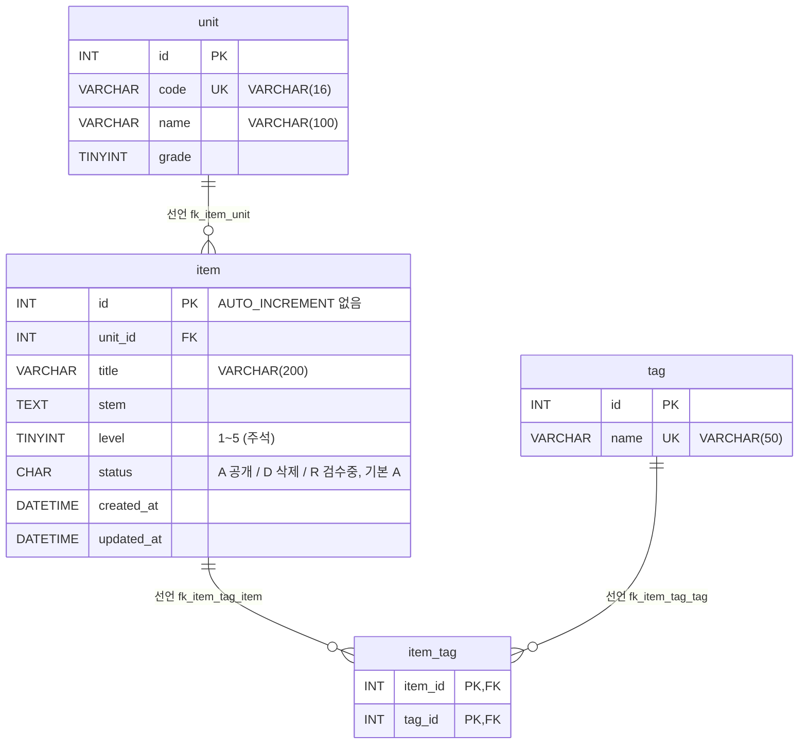

# legacy/item-bank-php 데이터 흐름 · ERD

> 분석 범위는 `legacy/item-bank-php` 가 읽고 쓰는 테이블과 뷰다. 진입점 · 의존 관계는 [ARCHITECTURE.md](ARCHITECTURE.md) 에 있다.
> 근거 경로 표기: 코드는 `legacy/item-bank-php/` 기준(예: `search.php:522`), 스키마는 `db/mariadb/init/01-schema.sql:줄`.
> 직접 열어 확인하지 못한 것은 "미확인"으로 둔다.

## 1. 테이블 목록

이 모듈이 참조하는 DB 객체는 테이블 4개와 뷰 1개다(참조 위치는 ARCHITECTURE.md 4절). 스키마 파일에 `AUTO_INCREMENT` · `TRIGGER` · `PROCEDURE` 는 없다(`db/mariadb/init/` 전체 grep 결과 0건).

| 테이블 | 주요 컬럼 | 키 · 제약 | 근거 |
|---|---|---|---|
| `unit` | `id` INT, `code` VARCHAR(16), `name` VARCHAR(100), `grade` TINYINT | PK `id`, UNIQUE `code`(`uk_unit_code`) | `01-schema.sql:11-18` |
| `item` | `id` INT, `unit_id` INT, `title` VARCHAR(200), `stem` TEXT, `level` TINYINT(주석 "1~5"), `status` CHAR(1) 기본값 `'A'`(주석 "A=공개 D=삭제 R=검수중"), `created_at` · `updated_at` DATETIME | PK `id`(AUTO_INCREMENT 없음), FK `unit_id` → `unit.id`(`fk_item_unit`), 인덱스 `unit_id` · `level` | `01-schema.sql:20-33` |
| `tag` | `id` INT, `name` VARCHAR(50) | PK `id`, UNIQUE `name`(`uk_tag_name`) | `01-schema.sql:35-40` |
| `item_tag` | `item_id` INT, `tag_id` INT | PK (`item_id`, `tag_id`), FK `item_id` → `item.id`(`fk_item_tag_item`), FK `tag_id` → `tag.id`(`fk_item_tag_tag`) | `01-schema.sql:42-48` |
| `v_item_public` (뷰) | `id`, `unit_id`, `unit_code`, `unit_name`, `unit_grade`, `title`, `stem`, `level`, `created_at`, `updated_at`, `tag_names`(태그 이름을 `t.id` 순으로 `,` 로 이은 값) | `item JOIN unit` + `WHERE i.status = 'A'` | `01-schema.sql:52-70` |

- 같은 스키마 파일에 `class` · `assignment` · `distribution` · `submission` 도 있지만(`01-schema.sql:75-115`), 이 모듈은 참조하지 않는다. 주석상 다른 모듈(assignment-thymeleaf)이 쓴다(`01-schema.sql:73`).
- 그중 `assignment.unit_id` → `unit.id` FK(`01-schema.sql:89`)는 이 모듈의 `unit` 을 가리킨다.

## 2. 테이블 관계

"선언"은 스키마의 `FOREIGN KEY`, "추정"은 코드의 JOIN · 상관 서브쿼리에서만 보이는 관계다. 이 모듈 코드의 JOIN 은 모두 선언된 FK 와 일치했고, **"추정"으로만 남는 관계는 없다.** 대응 근거는 표 아래에 있다.



뷰 `v_item_public` 은 `item` 과 `unit` 을 `u.id = i.unit_id` 로 JOIN 하고, 상관 서브쿼리로 `item_tag` · `tag` 에서 `tag_names` 를 만든다(`01-schema.sql:64-70`).

| 코드 · 뷰의 연결 조건 | 위치 | 대응하는 선언 FK |
|---|---|---|
| `i.unit_id = u.id` (단원별 문항 수 서브쿼리) | `units.php:17` | `fk_item_unit` `01-schema.sql:32` |
| `JOIN unit u ON u.id = i.unit_id` | `01-schema.sql:69` (뷰) | `fk_item_unit` `01-schema.sql:32` |
| `JOIN tag t ON t.id = it.tag_id` | `search.php:244`, `01-schema.sql:66` (뷰) | `fk_item_tag_tag` `01-schema.sql:47` |
| `it.item_id = v_item_public.id` / `it.item_id = i.id` | `search.php:245`, `01-schema.sql:67` (뷰) | `fk_item_tag_item` `01-schema.sql:46` (뷰의 `id` 는 `i.id`, `01-schema.sql:54`) |

## 3. 읽기 · 쓰기 위치

`units.php` · `register.php` 는 함수 없이 파일 최상위에서 SQL 을 실행하므로 "(최상위)"로 적는다. `search.php` 는 `buildSearchQuery` 가 SQL 을 조립하고 `runSearchQuery` 가 실행한다.

| 테이블 · 뷰 | 읽기 (SELECT) | 쓰기 (INSERT · UPDATE · DELETE) |
|---|---|---|
| `unit` | `units.php` (최상위) 단원 목록 `units.php:16-20`<br>`register.php` (최상위) 단원 선택 목록 `register.php:27`<br>`search.php` `buildSearchQuery` 단원 이름 조회 `search.php:125`, 선택 목록 `search.php:156`<br>`search.php` `runSearchQuery` → 뷰 경유 `search.php:577,600` | 없음 |
| `item` | `units.php` (최상위) 공개 문항 수 서브쿼리 `units.php:17`<br>`register.php` (최상위) 다음 ID 계산 `SELECT COALESCE(MAX(id),0)+1 … FOR UPDATE` `register.php:87`<br>`search.php` `runSearchQuery` → 뷰 경유 `search.php:577,600` | **INSERT**: `register.php` (최상위) `register.php:92-99`. 트랜잭션 안(`register.php:85,114`)에서 `status='R'`, `created_at` · `updated_at` = `NOW()` 로 저장(`register.php:94`)<br>UPDATE · DELETE: 없음 |
| `tag` | `register.php` (최상위) 태그 선택 목록 `register.php:34`<br>`search.php` `buildSearchQuery` 선택 목록 `search.php:178`, 태그 조건 EXISTS 조립 `search.php:244` (실행은 `runSearchQuery` `search.php:577,600`)<br>뷰 `tag_names` 경유 `01-schema.sql:64-67` | 없음 |
| `item_tag` | `search.php` `buildSearchQuery` 태그 조건 EXISTS 조립 `search.php:244-245` (실행은 `runSearchQuery` `search.php:577,600`)<br>뷰 `tag_names` 경유 `01-schema.sql:64-67` | **INSERT**: `register.php` (최상위) `register.php:105-111`. 같은 트랜잭션 안이며, 목록에 있는 태그 ID만 넣는다(`register.php:74-81`)<br>UPDATE · DELETE: 없음 |
| `v_item_public` | `search.php` `runSearchQuery` 건수 `search.php:577`, 목록 `search.php:600`. SQL 은 `buildSearchQuery` 가 조립(`search.php:521-526`)하고, 읽는 컬럼은 `id, title, unit_code, level, tag_names, created_at`(`search.php:521`) | 해당 없음 (뷰) |

- 모듈 전체에서 쓰기 SQL 은 `register.php` 의 INSERT 두 개뿐이다. `UPDATE` · `DELETE` 문은 없다(`legacy/item-bank-php` grep 결과, `FOR UPDATE` 절 `register.php:87` 제외).
- 상태 판정은 두 경로로 한다.
  - `units.php` 는 `item.status = 'A'` 를 직접 건다(`units.php:17`).
  - `search.php` 는 `status='A'` 로 거르는 뷰(`01-schema.sql:70`)를 통해 읽는다.

### 데이터 흐름 요약

```
등록  register.php  POST → 검증(register.php:47-81) → item INSERT status='R' → item_tag INSERT
                                                        │
                                  (R → A 로 바꾸는 코드는 이 모듈에 없음)
                                                        ▼
조회  units.php     item.status='A' 직접 필터 → 단원별 공개 문항 수
      search.php    v_item_public (status='A') → 목록 · 건수
```

## 4. 미확인 목록

| 항목 | 상태 | 확인할 곳 |
|---|---|---|
| `item.status` 를 `R` → `A`, 또는 `D` 로 바꾸는 주체 | 미확인. 이 모듈에는 UPDATE 가 없어서, 여기서 등록한 문항은 모듈 안에서는 검색에 나올 수 없다 | 다른 모듈(`legacy/` 의 다른 폴더) · 운영 절차 |
| 뷰 주석 "등록 화면이 모두 이 뷰를 기준으로 삼는다"(`01-schema.sql:51`) | 코드와 다르다. `register.php` 에는 `v_item_public` 참조가 없다 | 주석이 낡은 것인지 확인 |
| `MAX(id)+1 … FOR UPDATE`(`register.php:87`)가 동시 등록에서 ID 충돌을 막는지 | 미확인. `item.id` 에 AUTO_INCREMENT 가 없는 것만 확인했다(`01-schema.sql:21`) | 동시성 테스트 |
| 실행 중인 DB 의 스키마가 init SQL 과 같은지 | 미확인. init SQL 파일만 읽었다 | 컨테이너 DB `SHOW CREATE TABLE` |
| 시드 데이터 내용(`db/mariadb/init/02-seed.sql`) | 미확인. `INSERT INTO` 대상 테이블 이름만 확인했다(`02-seed.sql:9,19,36,76`) | 비즈니스 규칙 단계 |
| `item.level` 의 1~5 범위를 DB 가 강제하는지 | 미확인. 스키마에는 주석만 있고 CHECK 제약은 없다(`01-schema.sql:25`) | 실행 중인 DB 확인 |
| `item.status` 값 집합을 DB 가 강제하는지 | 미확인. 스키마에는 주석만 있고 CHECK 제약 · ENUM 은 없다(`01-schema.sql:26`) | 실행 중인 DB 확인 |
